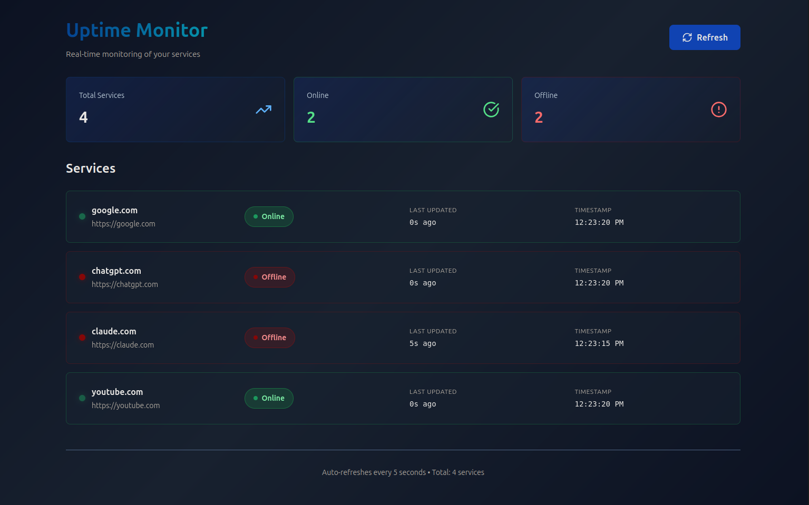

# Uptime Monitor

Real-time monitoring dashboard for your services.



## Features

- Monitor multiple services (HTTP endpoints)
- Real-time status updates via WebSocket
- Online/offline stats and last updated timestamps
- Auto-refresh every 5 seconds (frontend backup)
- Status badges and color-coded service cards

## Tech Stack

- **Frontend**: React + TypeScript + Lucide icons
- **Backend**: NestJS + Axios + WebSocket Gateway
- **Realtime**: WebSocket for live updates

## Getting Started

### Backend

1. Install dependencies
   ```bash
   cd Backend
   npm install
   ```
